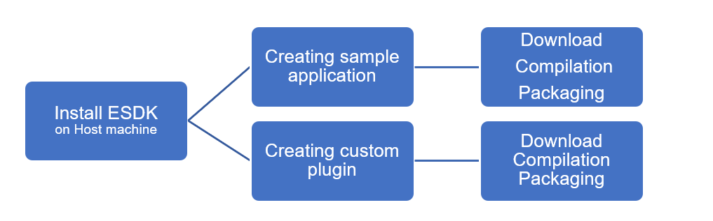
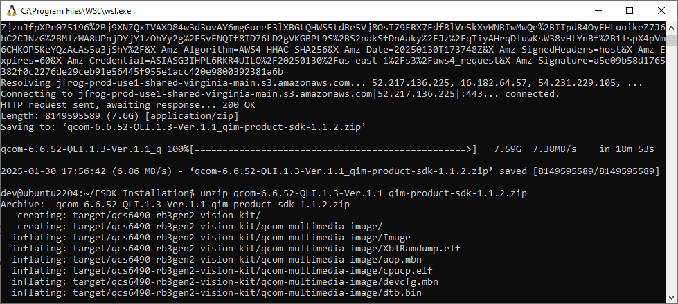
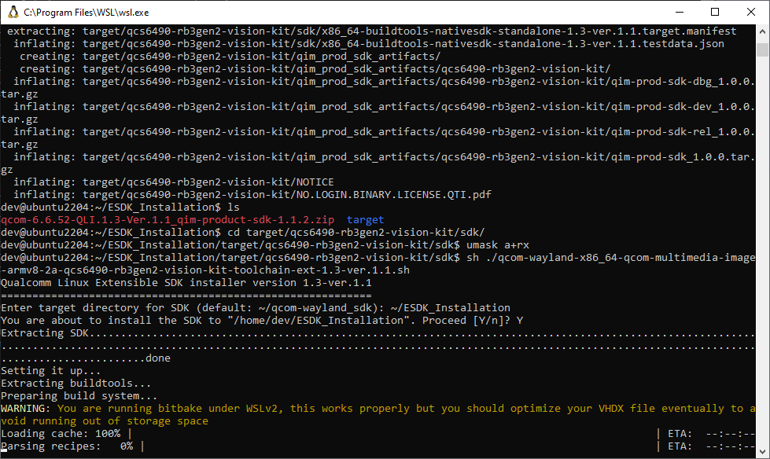
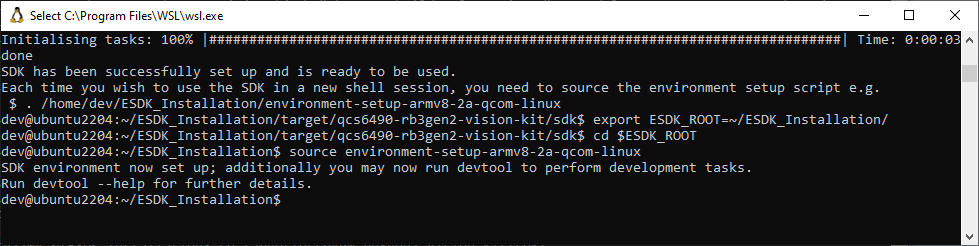
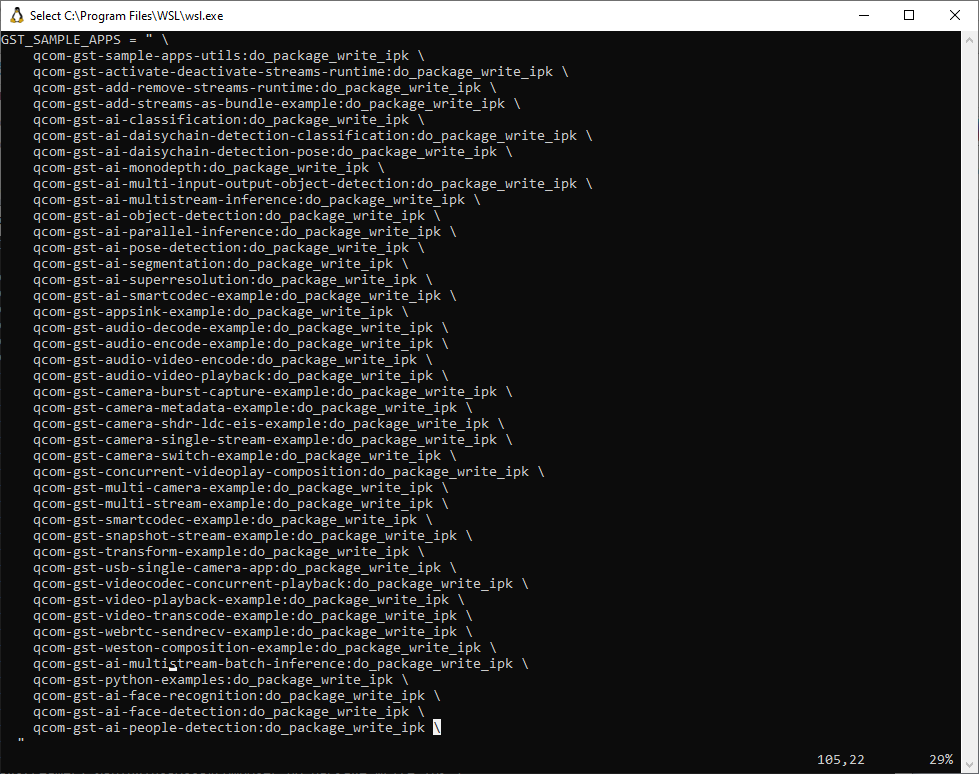
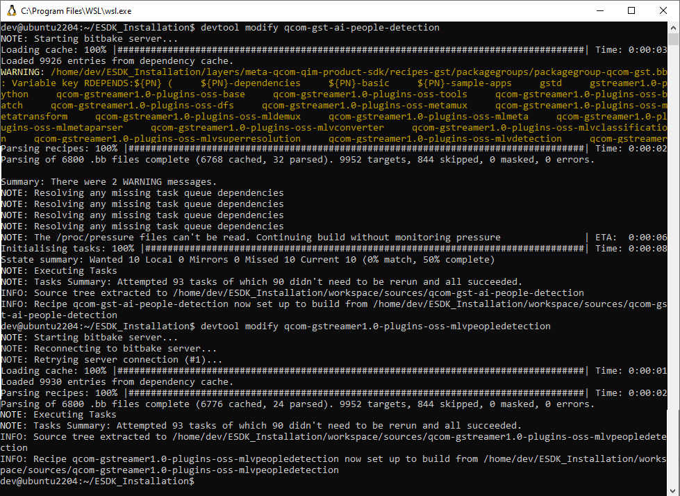
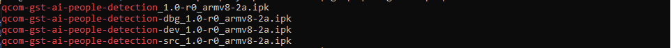
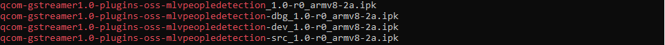
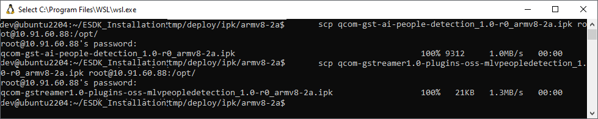
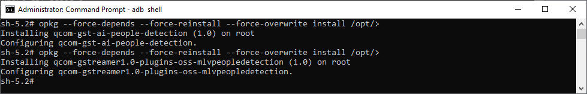

# 1 People Detection Solutions for Retail Store Use Case

Demonstrating this use case for queue analysis in retail stores involves detecting people in queues and integrating into the people counter system. This approach helps accurately count the number of people waiting in line, providing valuable data to improve service efficiency and reduce wait times.

## 1.1 Overview

This project utilizes the RB3 Gen2 device to analyze people in queues. The RB3 captures frames or images from the camera feed, and the YOLO model detects and counts the number of people. It leverages CPU, DSP, and GPU runtimes, as well as the Enhanced SDK (ESDK), providing developers with tools and resources to download and compile the AI applications.

## 1.2 Requirements
 
### 1.2.1 Hardware Requirements

This section outlines the hardware components for the use case.

- Development board based on the Qualcomm QCS6490 processor
- 12V power supply
- Type-C cable
- HDMI
- Monitor

### 1.2.2 System Requirements

The application development requires two environments

__Windows 10/11:__ This environment is used for running and testing the applications

__Ubuntu 22.04 Host Machine__:The host machine should be running Ubuntu 22.04 with at least 100 GB of free space. This environment is crucial for compiling the applications within the shell. 

## 1.3 Setting up the Hardware and System Requirments

### 1.3.1 Set up RB3 Gen2 device.

This section will walk you through RB3 Gen2 Quick Start Guide and Usecase reference docs.

- The Qualcomm RB3 Gen 2, based on the QCS6490 processor, is an IoT development kit designed for high-performance computing, accessibility, and advanced features.  <a href="https://www.qualcomm.com/developer/hardware/rb3-gen-2-development-kit/purchase" target="_blank"> Buy Qualcomm RB3 Gen 2 Vision Kit</a>

- The RB3 Gen 2 Development Kit comes preloaded with software that helps you to quickly set up the device or if needed Update the software.

#### Update the Software

Follow below Windows x86 hosts setup instructions as outlined for each OS to get the development kit for run the applications.

__Reference__<a href="https://docs.qualcomm.com/bundle/publicresource/topics/80-70017-253/set_up_the_device.html?vproduct=1601111740013072&version=1.3" target="_blank"> Quick Start Guide </a>

- To download the QIMP SDK for vision kit on an x86 host, paste the following URL into a browser:
<a href="https://artifacts.codelinaro.org/artifactory/qli-ci/flashable-binaries/qimpsdk/qcs6490-rb3gen2-vision-kit/x86/qcom-6.6.52-QLI.1.3-Ver.1.1_qim-product-sdk-1.1.2.zip" target="_blank"> QIMP SDK </a>

- Unzip the downloaded file on the development host.

- Follow the PCAT instructions for updating the software <a href="https://docs.qualcomm.com/bundle/publicresource/topics/80-70017-253/set_up_the_device.html?vproduct=1601111740013072&version=1.3#panel-0-v2luzg93cw==tab$flash-using-pcat" target="_blank">Flash using PCAT</a>

### 1.3.2 Set up an Ubuntu VM on Windows 11 using WSL

Windows Subsystem for Linux (WSL) is a Windows feature that allows you to run Linux distributions on Windows, without using a virtualization software.

- This link provides detailed instructions for setting up <a href="https://docs.qualcomm.com/bundle/publicresource/topics/80-70017-41/set-up-windows-subsystem-for-linux-on-windows-11.html?vproduct=1601111740013072&version=1.3" target="_blank"> WSL on Windows 11 </a>

## 1.4 Application Development Prerequisite

This section guides you through the application requirements for application development.

### 1.4.1 Access the RB3 Gen2 Shell:

To interact with the RB3 Gen2 device, you need to access its shell. This can be done using either SSH or ADB, depending on your setup and preferences. Below are the methods to log into the RB3 Gen2 shell

#### Method 1: Login using SSH

Enable <a href="https://docs.qualcomm.com/bundle/publicresource/topics/80-70017-254/how_to.html#connect-to-the-network" target="_blank"> SSH </a> to log into the target device.

To obtain the IP address, first set up the <a href="https://docs.qualcomm.com/bundle/publicresource/topics/80-70017-254/how_to.html#connect-to-network" target="_blank"> Wi-Fi</a> , retrieve the IP address, and then log in to the device.

Log in to the SSH shell:

    ssh root@[ip-addr]

Note If prompted for a username and password , enter username `root` and password `oelinux123`.

#### Method 2: Login using ADB

Enable adb to log into the target device.<a href="https://docs.qualcomm.com/bundle/publicresource/topics/80-70017-253/additional_setup.html#install-adb" target="_blank"> Install and connect to ADB. </a>
    
    adb devices
    adb shell

### 1.4.2 Setup Read and Write Permission

On the target device, reconfigure the file system partition to support read and write permissions:

    setenforce 0
    mount -o remount,rw /
    mount -o remount, rw /usr

### 1.4.3 Download models and label files.

This section will guide you through downloading the <a href="https://docs.qualcomm.com/bundle/publicresource/topics/80-70017-253/demo_app.html?vproduct=1601111740013072&version=1.3#ai-applications" target="_blank"> models and labels </a> from AI-HUB:

To facilitate the use of the Yolo-NAS and Yolov8 models on the RB3 Gen2 device, follow these steps to download the necessary label files on linux host machine, set permissions, and transfer the files to the device.

    curl -L -O https://raw.githubusercontent.com/quic/sample-apps-for-qualcomm-linux/refs/heads/main/download_artifacts.sh
    chmod +x download_artifacts.sh
    ./download_artifacts.sh -v GA1.3-rel -c QCS6490
    cp yolonas.labels yolov8.labels
    scp <model filename and labels> root@<IP addr of the target device>:/opt/

To download the models, click on the links below:

<table class=custom>
<colgroup>
<col span="1" style="width: 60%;">
</colgroup>
<tr><th>Models and Labels</th><th>Download</th></tr>
<tr><td>Yolo-NAS Model</td><td><a href="https://huggingface.co/qualcomm/Yolo-NAS-Quantized/resolve/main/Yolo-NAS-Quantized.tflite?download=true" target="_blank">Yolo-NAS-Quantized.tflite </a></td></tr>
<tr><td>YoloV8 Model</td><td><a href="https://huggingface.co/qualcomm/YOLOv8-Detection-Quantized/resolve/main/YOLOv8-Detection-Quantized.tflite?download=true" target="_blank">YOLOv8-Detection-Quantized.tflite</td></tr>
</table>

__Reference:__
<a href="https://aihub.qualcomm.com/iot/models" target="_blank"> Qualcomm AI Hub.</a>

The YOLOv8 and YOlONas models is not available by default. You need to export the model using the AI Hub APIs. <a href="https://github.com/quic/ai-hub-models/tree/main/qai_hub_models/models/yolov8_det_quantized" target="_blank"> YoloV8 Model </a> and <a href="https://github.com/quic/ai-hub-models/tree/main/qai_hub_models/models/yolonas_quantized" target="_blank"> YoloNAS Model </a>

## 2 Developing a Smart People Counter Application

This section explains how to create people counter new application and create a custom mlvdetection plugin and compile it as part of the Qualcomm Intelligent Multimedia Product SDK. explain the required steps to add custom model postprocessing to the qtimlvdetection plugin.

- Setting up the ESDK.
- Create and Download the QIM SDK <a href="https://docs.qualcomm.com/bundle/publicresource/topics/80-70017-51/content-develop-your-first-application.html#develop-using-devtool-method" target="_blank"> Application </a> and <a href="https://docs.qualcomm.com/bundle/publicresource/topics/80-70017-50/develop-plugins-for-sdk.html#create-a-plugin" target="_blank"> Pulgin </a>
- After customizing,rebuild the sample application
- Generate the application and pulgin installer(ipk)
- Transfer the ipk to RB3 gen2 device
- Install the application on the target device:
- Run application by starting it from the terminal.

__Reference:__
 Qualcomm Linux includes various sample applications.<a href="https://docs.qualcomm.com/bundle/publicresource/topics/80-70017-50/example-applications.html?vproduct=1601111740013072&version=1.3&facet=Qualcomm%20Intelligent%20Multimedia%20SDK" target="_blank"> Sample applications </a>

## 2.1 eSDK Installation and Setup Guide

### Overview

This guide provides detailed instructions for installing and setting up the <a href="https://docs.qualcomm.com/bundle/publicresource/topics/80-70017-51/install-sdk.html#download-and-install-esdk" target="_blank"> eSDK </a> on your development kit.It is recommended to install eSDK from the Qualcomm public archive or compile it independently on your host machine.

The figure below illustrates the SDK workflow from setting up the device to developing your application.

### Step1: Download eSDK

Download eSDK on Ubuntu x86 Architecture-Based Host Machines
Follow these steps to download and set up the eSDK on Ubuntu x86 architecture-based host machines:

Create a workspace directory and navigate to it:

    mkdir ~/ESDK_Installation

Install necessary packages:

    sudo apt update && sudo apt-get install diffstat bzip2 gcc g++ unzip gcc-aarch64-linux-gnu

Download the eSDK:

    wget https://artifacts.codelinaro.org/artifactory/qli-ci/flashable-binaries/qimpsdk/qcs6490-rb3gen2-vision-kit/x86/qcom-6.6.52-QLI.1.3-Ver.1.1_qim-product-sdk-1.1.2.zip

unzip the Downloaded file

    unzip qcom-6.6.52-QLI.1.3-Ver.1.1_qim-product-sdk-1.1.2.zip

Run the setup script:

    cd ~/ESDK_Installation/target/qcs6490-rb3gen2-vision-kit/sdk/
    umask a+rx
    sh ./qcom-wayland-x86_64-qcom-multimedia-image-armv8-2a-qcs6490-rb3gen2-vision-kit-toolchain-ext-1.0.sh

### Step2: ESDK Environment Setup

Set the ESDK root environment variable:

    export ESDK_ROOT=~/ESDK_Installation/
    cd $ESDK_ROOT
    source environment-setup-armv8-2a-qcom-linux

## 2.2 Setup File Directory and Source Code

This step ensures that all necessary components are in place for building and running the GStreamer applications on the RB3 device. Properly setting up the source code is crucial for the successful execution of the people counter application.

### Step1: Create Directories

Create the necessary directories for the gstreamer files:

    mkdir -p $ESDK_ROOT/layers/meta-qcom-qim-product-sdk/recipes-gst/gstreamer/files
    mkdir -p $ESDK_ROOT/layers/meta-qcom-qim-product-sdk/recipes-gst/gstreamer-sample-apps/files

### Step2: Source Code Setup

Copy the Qualcomm IM SDK application and plugin source code to the eSDK:

Clone the repository:

    cd ~
    git clone https://github.com/quic/qilab_platform_apps.git

Copy the people counter application source code:

    cp -r ~/qilab_platform_apps/people_detection/gst-ai-people-detection/ $ESDK_ROOT/layers/meta-qcom-qim-product-sdk/recipes-gst/gstreamer-sample-apps/files/

Copy the mlvpeopledetection plugin source code:

    cp -r ~/qilab_platform_apps/people_detection/gst-plugin-mlvpeopledetection/ $ESDK_ROOT/layers/meta-qcom-qim-product-sdk/recipes-gst/gstreamer/files/

### Step3: Adding Bitbake Files

Bitbake files are used to define how software packages are built and integrated into the system. Copy the necessary bitbake files to the appropriate directories:

Copy the bitbake file for the AI people detection application:

    cp ~/qilab_platform_apps/people_detection/bitbake_files/qcom-gst-ai-people-detection.bb $ESDK_ROOT/layers/meta-qcom-qim-product-sdk/recipes-gst/gstreamer-sample-apps/

Copy the bitbake file for the gstreamer plugin:

    cp ~/qilab_platform_apps/people_detection/bitbake_files/qcom-gstreamer1.0-plugins-oss-mlvpeopledetection.bb $ESDK_ROOT/layers/meta-qcom-qim-product-sdk/recipes-gst/gstreamer/

## 2.3 Integrating and Packaging Components

This steps is to include the applications and plugins are part of the build process and are included in the final image, making them available for deployment on the target device.

### Step1: Application and Plugin Configuration

The purpose of this step is to include the qcom-gst-ai-people-detection and qcom-gstreamer1.0-plugins-oss-mlvpeopledetection components in the package group.

#### Adding qcom-gst-ai-people-detection

Navigate to the packagegroup-qcom-gst-sample-apps.bb file located at:

    $ESDK_ROOT/layers/meta-qcom-qim-product-sdk/recipes-gst/packagegroups/packagegroup-qcom-gst-sample-apps.bb

Add the following line under RDEPENDS:${PN}:qcom-custom-bsp:

    RDEPENDS:${PN}:qcom-custom-bsp += "qcom-gst-ai-people-detection"

#### Adding qcom-gstreamer1.0-plugins-oss-mlvpeopledetection

Navigate to the packagegroup-qcom-gst.bb file located at:

    $ESDK_ROOT/layers/meta-qcom-qim-product-sdk/recipes-gst/packagegroups/packagegroup-qcom-gst.bb

Add the following line under RDEPENDS:${PN}:qcom-custom-bsp:
    
    RDEPENDS:${PN}:qcom-custom-bsp += "qcom-gstreamer1.0-plugins-oss-mlvpeopledetection"

### Step2: Configure IPK Installer

This step is crucial for generating the necessary IPK files, which are the installable packages for these components. By doing this, ensure that the applications and plugins are correctly packaged and ready for deployment.

To include qcom-gst-ai-people-detection and qcom-gstreamer1.0-plugins-oss-mlvpeopledetection in the package writing process, follow these steps:

Navigate to the qimsdk-pkg.bbclass file located at:

    $ESDK_ROOT/layers/meta-qcom-qim-product-sdk/classes/qimsdk-pkg.bbclass

Add the following line under GST_SAMPLE_APPS:

    GST_SAMPLE_APPS = " \
        qcom-gst-ai-people-detection:do_package_write_ipk \
        ..."

Add the following line under GST_PLUGINS:

    GST_PLUGINS = " \
        qcom-gstreamer1.0-plugins-oss-mlvpeopledetection:do_package_write_ipk \
        ..."

## 2.4 Compilation Procedure

The following steps guide you through downloading, compiling, packaging, and verifying the Qualcomm IM SDK application and plugin. This ensures that the application and plugin are correctly built and ready for deployment on the target device.

#### Download the Application and Plugin Source Code

First, navigate to the ESDK root directory.

    cd $ESDK_ROOT
    devtool modify qcom-gst-ai-people-detection
    devtool modify qcom-gstreamer1.0-plugins-oss-mlvpeopledetection

#### Build the Application and Plugin

Update your RB3 IP address in publish_people_count.c under people_counter_server_init() for running the server application in next section.

    if ((server_fd = socket_server_init("10.91.59.154", SOCKET_PORT_NO)) == SOCKET_ERROR_FAILURE) {
    // Handle error
    }

After updating ip address build the application and plugin using the following commands:

    devtool build qcom-gst-ai-people-detection
    devtool build qcom-gstreamer1.0-plugins-oss-mlvpeopledetection

#### Generate the Plugin Installer (ipk)

To install the application on the target device, generate the plugin installer:

    devtool package qcom-gst-ai-people-detection
    devtool package qcom-gstreamer1.0-plugins-oss-mlvpeopledetection

#### Verify the Installable Packages

On the host machine, verify the application and plugin installer:

    ls $ESDK_ROOT/tmp/deploy/ipk/armv8-2a | grep qcom-gst-ai-people-detection
    ls $ESDK_ROOT/tmp/deploy/ipk/armv8-2a | grep qcom-gstreamer1.0-plugins-oss-mlvpeopledetection

## 2.5 Transferring Installers to the Target Device

The purpose of this step is to transfer the compiled application and plugin installers from the host machine to the target RB3 Gen2 device using the scp. This ensures that the necessary files are available on the target device for installation and execution.

__Note__: Before proceeding, verify that the command `mount -o remount,rw /` has been executed to enable read and write permissions on RB3 using SSH or ADB shell, as detailed in section 1.4.2.

    cd $ESDK_ROOT/tmp/deploy/ipk/armv8-2a/
    scp qcom-gst-ai-people-detection_1.0-r0_armv8-2a.ipk root@<ip_address>:/opt/
    scp qcom-gstreamer1.0-plugins-oss-mlvpeopledetection_1.0-r0_armv8-2a.ipk root@<ip_address>:/opt/

Replace <ip_address> with the actual IP address of the target RB3 Gen2 device.

## 2.6 Install Packages on RB3 Gen2

This section explains how to set up the Wayland display on RB3 Gen2 to view the application execution on the HDMI display and install the necessary packages. This setup also includes enabling logging for debugging purposes.

### Step1: Set Up Wayland Display

Execute the following commands to set up the Wayland display and enable logging on RB3 Gen2

    adb shell
    export GST_DEBUG=6
    export GST_DEBUG_FILE=/opt/gstlogs_act_deact.txt
    export XDG_RUNTIME_DIR=/dev/socket/weston && export WAYLAND_DISPLAY=wayland-1
    mount -o remount,rw /
    mount -o remount, rw /usr

### Install the Packages

In the RB3 shell, run the following commands to install the application and plugin:

    opkg --force-depends --force-reinstall --force-overwrite install /opt/qcom-gst-ai-people-detection_1.0-r0_armv8-2a.ipk
    opkg --force-depends --force-reinstall --force-overwrite install /opt/qcom-gstreamer1.0-plugins-oss-mlvpeopledetection_1.0-r0_armv8-2a.ipk

## __Optional__

### Rebuild the Application

This step ensures that any changes or customizations are incorporated into the build, and the updated application and plugin are ready for deployment on the target device.

If any customizations have been made, rebuild the application and plugin using the following commands. After rebuilding, package the files and transfer them to the target device for execution:

    devtool build qcom-gst-ai-people-detection
    devtool build qcom-gstreamer1.0-plugins-oss-mlvpeopledetection

## 2.7 Procedure to Run the People Counter Application

This section demonstrates the execution of the people counter application on the RB3 device, which includes both the client and server applications.

## 2.7.1 Compile the Client Application

To compile the client application, follow these steps:

#### Step 1: Update Server IP

Update the RB3 server IP address in the receive_people_count.c file. This will allow the client to take data from device.

#### Step2: Compile

    cd ~/qilab_platform_apps/people_detection/client-application
    make
    tree

## 2.7.2 Running the People Counter Application

The gst-ai-people-detection application is used as the server, and the socket application works as the client. First, run the server application, and then run the client application.

#### Step1 : Execute Server Application

The purpose of this step is to run the  YOLO_NAS models from the TFLite framework.

    gst-ai-people-detection --file-path=/opt/video.mp4 -t 3 -f 2 --model=/opt/Yolo-NAS-Quantized.tflite --labels=/opt/yolonas.labels -k "yolo-nas,q-offsets=<37.0,0.0, 0.0>,q-scales=<3.416602611541748, 0.00390625, 1.0>;"

__Note__

Ensure that the Q-offset values are updated according to the model properties. For more details,refer to the Qualcomm documentation on <a href="https://docs.qualcomm.com/bundle/publicresource/topics/80-70017-15B/integrate-ai-hub-models.html#obtain-model-constants" target="_blank"> obtain-model-constants</a>

- Open the downloaded TFLite model with a graph viewer tool like <a href="https://netron.app/" target="_blank"> Netron</a>
- Check the ouput node and update the q-offsets and q-scales values according to the model output property.

Ensure that the receive_people_count.c and publish_people_count.c files contain same server IP address.

#### Step 2: Execute the Client Application

If you want to run the application on the RB3 device, use the ./socket_client_arm64 binary. If you are running it on another Intel architecture, use the ./socket_client_x86 binary.
In another terminal, run the client application:

    cd ~/qilab_platform_apps/people_detection/client-application/build_x86/
    ./socket_client_x86

## Optional

### Running the Server Application

These models can be tested with the YOLO-NAS model using the Qualcomm Neural Processing SDK runtime and the YOLO-NAS and YOLOv8 models from the TFLite framework. This can be done using both camera and file sources.

#### Executing with Camera Source

To execute the application using a camera source, run the following commands:

    cd /usr/bin/
    gst-ai-people-detection --yolo-model-type=3 --model=/opt/yolonas.dlc --labels=/opt/yolonas.labels

    gst-ai-people-detection -t 2 -f 2 --model=/opt/yolov8_det_quantized.tflite --labels=/opt/yolov8.labels -k "YOLOv8,q-offsets=<-107.0, -128.0, 0.0>,q-scales=<3.093529462814331, 0.00390625, 1.0>;"

    gst-ai-people-detection -t 3 -f 2 --model=/opt/Yolo-NAS-Quantized.tflite --labels=/opt/yolonas.labels -k "yolo-nas,q-offsets=<37.0,0.0, 0.0>,q-scales=<3.416602611541748, 0.00390625, 1.0>;"

#### Executing with File Source

To execute the application using a file source, run the following commands:

    gst-ai-people-detection --file-path=/opt/video.mp4 --ml-framework=1 --yolo-model-type=3 --model=/opt/yolonas.dlc --labels=/opt/yolonas.labels

    gst-ai-people-detection --file-path=/opt/video.mp4 -t 2 -f 2 --model=/opt/yolov8_det_quantized.tflite --labels=/opt/yolov8.labels -k "YOLOv8,q-offsets=<-107.0, -128.0, 0.0>,q-scales=<3.093529462814331, 0.00390625, 1.0>;"

    gst-ai-people-detection --file-path=/opt/video.mp4 -t 3 -f 2 --model=/opt/Yolo-NAS-Quantized.tflite --labels=/opt/yolonas.labels -k "yolo-nas,q-offsets=<37.0,0.0, 0.0>,q-scales=<3.416602611541748, 0.00390625, 1.0>;"
